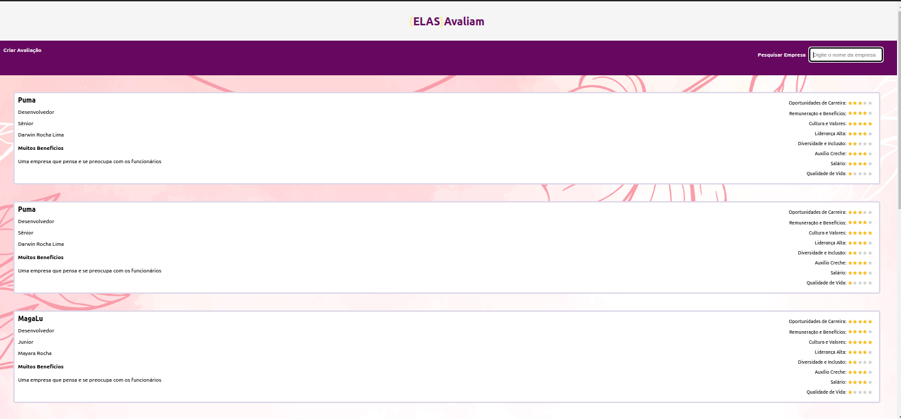
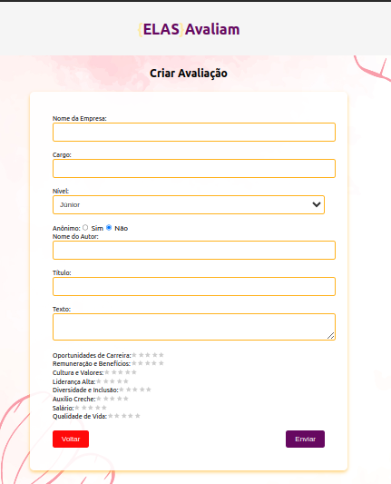

# Elas Avaliam

## Descrição do Projeto

O **Elas Avaliam** é uma plataforma projetada para permitir que mulheres avaliem ambientes de trabalho. O objetivo é fornecer um espaço seguro para que possam compartilhar suas experiências, ajudando outras mulheres a encontrar empresas que promovem a inclusão, a diversidade e o bem-estar no ambiente corporativo. Usuárias podem optar por fazer avaliações anônimas ou assinar com seus próprios nomes.

## Tecnologias Usadas

- **Node.js**: Back-end da aplicação.
- **NestJS**: Framework para criar a API.
- **React**: Front-end da aplicação.
- **TypeScript**: Usado tanto no back-end quanto no front-end para fornecer tipagem estática.
- **PostgreSQL**: Banco de dados utilizado para armazenar as avaliações.
- **Axios**: Biblioteca para fazer as requisições HTTP no front-end.
- **React Simple Star Rating**: Componente para implementar a funcionalidade de avaliações com estrelas.

## Funcionalidades das Páginas

### Página Inicial

A **Página Inicial** exibe uma lista de todas as avaliações cadastradas, permitindo que os usuários pesquisem empresas específicas pelo nome. Ela inclui uma barra de pesquisa no topo, onde o usuário pode buscar pelas avaliações de uma empresa específica. Além disso, há um link para criar uma nova avaliação.

### Página de Criar Avaliação

A **Página de Criar Avaliação** permite que o usuário preencha um formulário com informações sobre a empresa que deseja avaliar. O formulário contém os seguintes campos:
- Nome da Empresa
- Cargo
- Nível (Júnior, Pleno, Sênior)
- Opção para Anônimo ou com Nome do Autor
- Título da Avaliação
- Texto descritivo da avaliação
- Avaliação por estrelas em várias categorias (Oportunidades de Carreira, Remuneração, Cultura, Liderança, etc.)

Após o preenchimento, o usuário pode submeter a avaliação, que será listada na página inicial.

Criado por Mayara Rocha 🌼
